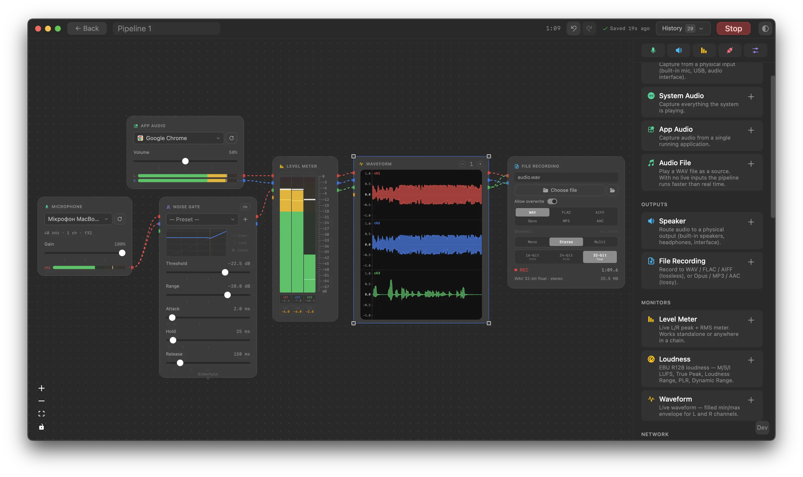

[](https://github.com/Horuse/Splitwave/releases/latest)
[](https://github.com/Horuse/Splitwave#support)

# Splitwave

Splitwave is a node-based audio router for macOS, Linux, and Windows. Wire microphones, system audio, per-app capture, and WAV files into a visual graph, run them through a chain of effects — EQ, compression, reverb, limiting, and more, plus your own CLAP, VST3 and AU plugins — then send the result to speakers or record it in WAV, FLAC, AIFF, MP3, Opus, or AAC.



## Installation

### macOS

Download the latest `.dmg` from [Releases](https://github.com/Horuse/Splitwave/releases/latest),
open it, and drag Splitwave to Applications.

**macOS will block the app on first launch** ("cannot verify developer") because the
binary is not notarized. To allow it, run once in Terminal:

```bash
xattr -cr /Applications/Splitwave.app
```

Then open Splitwave normally.

**After each update, Screen Recording permission resets** (macOS revokes it when the binary changes and the app is unsigned). To re-grant it: open System Settings → Privacy & Security → Screen Recording, click **−** to remove Splitwave, then click **+** and add it back.

### Linux

Requires a PipeWire-based audio session (default on most current distros).
Device-volume control additionally needs the PulseAudio compatibility layer
(`pipewire-pulse`, also default on most distros).
Download the build for your system from [Releases](https://github.com/Horuse/Splitwave/releases/latest):

- **AppImage** — `chmod +x Splitwave_*.AppImage && ./Splitwave_*.AppImage`
- **`.deb`** (Debian/Ubuntu) — `sudo apt install ./Splitwave_*.deb`
- **`.rpm`** (Fedora/RHEL/openSUSE) — `sudo rpm -i Splitwave-*.rpm`

### Windows

Requires Windows 10 version 2004 or newer (for per-app capture) and the
[WebView2 runtime](https://developer.microsoft.com/microsoft-edge/webview2/)
(preinstalled on current Windows 10/11). Download the `.exe` installer from
[Releases](https://github.com/Horuse/Splitwave/releases/latest) and run it.

Virtual audio devices are not available on Windows.

## Platform support

| Feature                                   |          macOS           |          Linux           |              Windows              |
| ----------------------------------------- | :----------------------: | :----------------------: | :-------------------------------: |
| Mic / speaker device I/O                  |            ✅            |            ✅            |                ✅                 |
| N-channel microphone arrays               | ⚠️ implemented, untested | ⚠️ implemented, untested |     ⚠️ implemented, untested      |
| System audio capture                      |   ✅ ScreenCaptureKit    |       ✅ PipeWire        |        ✅ WASAPI loopback         |
| Per-app audio capture                     |   ✅ ScreenCaptureKit    |       ✅ PipeWire        | ✅ Process Loopback (Win10 2004+) |
| App icons in the picker                   |            ✅            |            ✅            |                ✅                 |
| Device volume control                     |            ✅            |            ✅            |                ✅                 |
| Recording: WAV / FLAC / AIFF / MP3 / Opus |            ✅            |            ✅            |                ✅                 |
| Recording: AAC (M4A)                      |            ✅            |            ❌            |                ❌                 |
| Virtual audio devices                     |   ✅ AudioServerPlugin   |  ✅ PipeWire null-sinks  |  ❌ (no user-mode driver model)   |
| Effects, metering, file playback          |            ✅            |            ✅            |                ✅                 |
| CLAP plugins                              |            ✅            |            ✅            |                ✅                 |
| VST3 plugins                              |            ✅            |          ✅ X11          |                ✅                 |
| Audio Unit plugins                        |            ✅            |            ❌            |                ❌                 |

## Features

- **Inputs:** microphones, system audio, per-application audio, WAV files,
  virtual device loopback, and N-channel microphone arrays with shared-clock
  or experimental independent-device synchronization
- **Outputs:** physical speakers/interfaces, file recording in WAV (16/24-bit
  PCM + 32-float), FLAC, AIFF, Opus, MP3, AAC (M4A), virtual devices
- **Effects:** Gain, Mute, Channel Balance, Saturator, 10-band Graphic EQ,
  Brick-wall Limiter with look-ahead, Compressor (with sidechain), Noise Gate
  (with sidechain), Noise Suppressor, De-esser, Declick, Stereo Delay,
  Algorithmic Reverb (Freeverb), Level Meter, EBU R128 LUFS Meter, Waveform and
  Spectrum analyzers
- **Plugins:** host your own CLAP and VST3 plugins (all platforms) and Audio
  Unit plugins (macOS) as effect nodes, with the native editor embedded in the
  app, parameters editable in the node, and plugin state saved with the
  pipeline. On Linux, plugin editors need an X11 session (XWayland works);
  VST3 defines no Wayland embedding
- **Presets & templates:** shared effect presets with factory defaults, plus
  ready-made pipeline templates in the create flow, including
  `Spatial Voice — Multi-Mic`
- **Virtual devices:** create named virtual audio devices that appear system-wide.
  Use them to capture loopback audio from any app or to feed processed audio into
  apps that accept a microphone input (DAWs, Discord, etc.)

System and per-app capture use **ScreenCaptureKit** on macOS, **PipeWire** on
Linux, and **WASAPI loopback** / the **Process Loopback API** on Windows. Virtual
devices are AudioServerPlugin drivers on macOS and PipeWire null-sinks on Linux;
Windows has no user-mode virtual-device model, so they are unavailable there.

Microphone Array combines two or more selected physical input channels into one
calibrated mono `Spatial Voice` stream. It supports linear, circular,
rectangular, and custom geometry; fixed direction or point targets;
Delay-and-Sum, GSC, and MVDR processing; live diagnostics; and safe fallback.
One multichannel interface is recommended. Independent USB devices work in an
explicitly experimental clock-synchronization mode and are less stable. See the
[Microphone Array guide](docs/microphone-array.md),
[architecture](docs/microphone-array-architecture.md), and
[hardware test guide](docs/microphone-array-hardware-test.md).

## Stack

- **Frontend:** Svelte, Tauri, @xyflow/svelte
- **Engine:** Rust -- `rtrb` (SPSC ring buffers), `rubato` (resampling),
  `hound` (WAV), `flac-codec`, `opus`, `mp3lame-encoder`, `ebur128`
- **macOS:** `cpal` device I/O; custom Swift static library for ScreenCaptureKit,
  compiled by `build.rs` via `swiftc`; CoreAudio HAL FFI for device enumeration;
  libASPL-based AudioServerPlugin for the virtual device driver
- **Linux:** `pipewire` for device I/O, system/app capture, and virtual
  null-sinks; `libpulse-binding` for device-volume control (talks to
  `pipewire-pulse`); `freedesktop-desktop-entry` / `freedesktop-icons` for app
  icons
- **Windows:** `cpal` (WASAPI) device I/O; the `windows` crate for WASAPI
  loopback + Process Loopback capture, `IAudioEndpointVolume`, audio-session
  enumeration, and exe icon extraction (`png` for encoding)

## Development

See [DEVELOPMENT.md](DEVELOPMENT.md) for prerequisites, setup, useful commands,
and project layout.

## License

Splitwave is licensed under [MIT](LICENSE).  
Third-party component notices (LGPL, MPL-2.0, etc.) are in [NOTICE](NOTICE).

## Support

If you find this app useful, consider supporting it:

- Tether USDT (TRC20): `TLhTvnn8CtVuQZruLXmRurGhR9GWd7DrWZ`
- TON: (TON) `UQCpokpaZfwmVTjKDj0LrAbEPO-65c81-MiuBQOa7lTXbMGR`
- Bitcoin (BTC): `bc1q6tusr5rht7dgmw8gqzkx7rwdg4q8932lwn2rsy`
