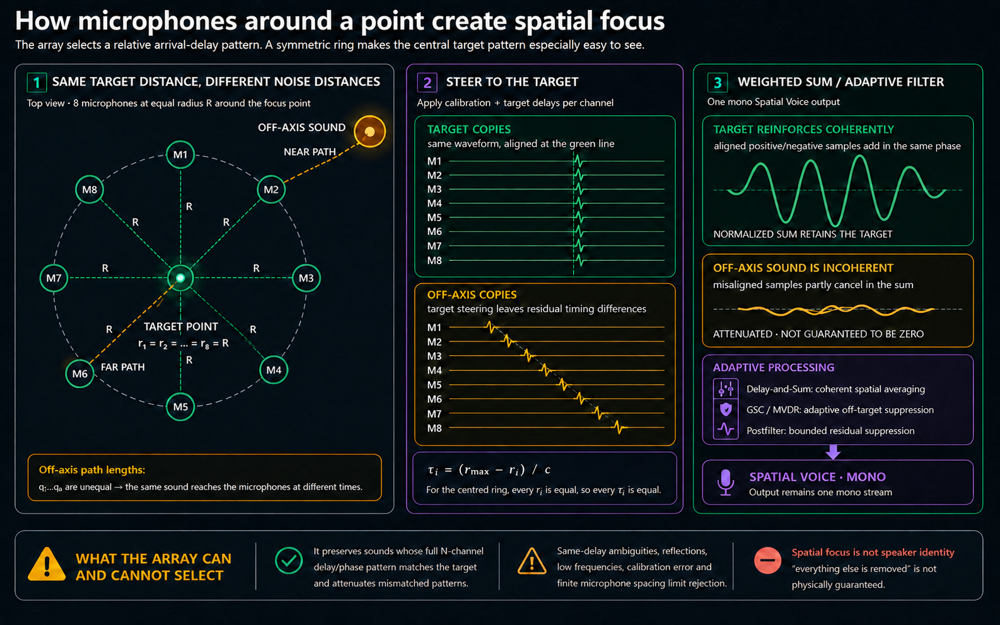
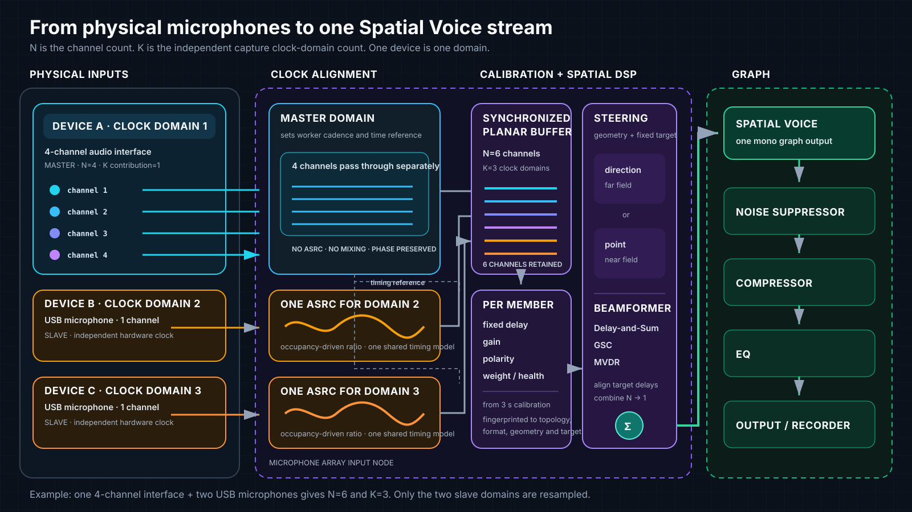
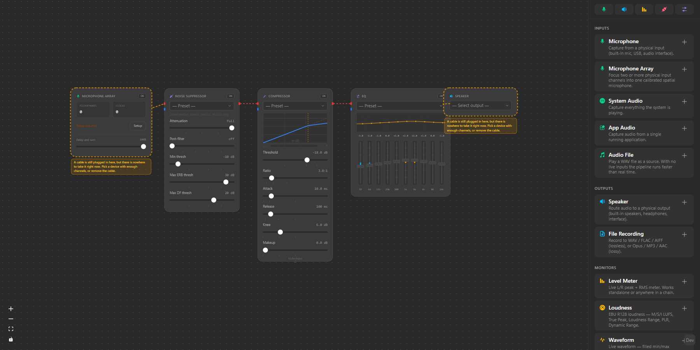
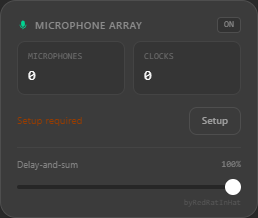
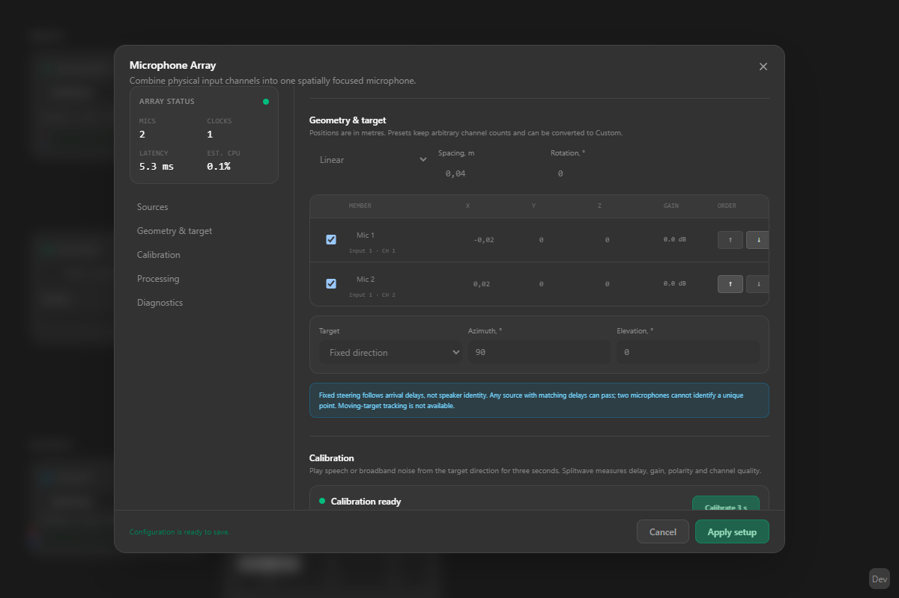
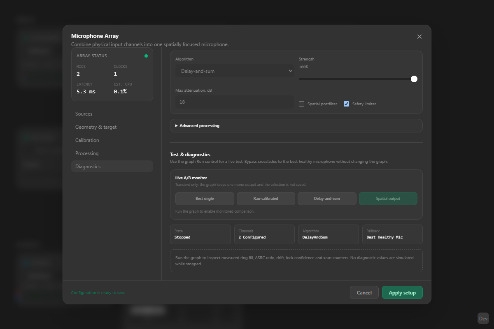
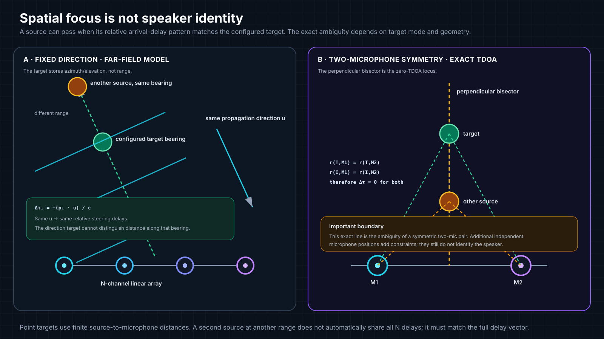

# Microphone Array

## What this feature is, why it exists, and how it works

**Microphone Array is a native N-channel input node that turns two or more
physical microphone channels into one spatially focused mono stream named
`Spatial Voice`.** It is intended for a fixed speaking position such as a desk,
podcast seat, recording position, lectern, or conferencing spot where several
microphones can observe the same sound field from known locations.

A single microphone can describe only the waveform at one point. It cannot use
the fact that a wanted voice reaches several places with one predictable set of
arrival delays while a keyboard, fan, loudspeaker, or second talker reaches
those places with another set. A microphone array preserves the identity and
timing of every physical channel long enough to exploit those spatial
differences. This happens before the ordinary Noise Suppressor and is a
different job from spectral denoising or speaker recognition.

Splitwave performs the feature as one deterministic signal path:

1. Capture every selected physical channel without mixing the channels first.
2. Preserve channels that share a hardware clock and synchronize each
   independent slave device with one clock-domain ASRC.
3. Calibrate fixed channel delay, gain, polarity, and channel quality.
4. Use the measured microphone geometry and a fixed direction or point target
   to predict the target's relative acoustic arrival delays.
5. Align that target pattern and combine the channels with Delay-and-Sum, GSC,
   or MVDR spatial processing.
6. Publish exactly one mono `Spatial Voice` output to the normal Splitwave graph.

The circular example below makes the spatial principle visible. Eight
microphones sit at the same radius around the target point, so the wanted sound
has equal propagation distances and its eight calibrated copies line up. An
off-axis sound has unequal path lengths, so its copies remain staggered after
target steering. The wanted copies reinforce in the weighted sum; the
off-target copies partly cancel, and GSC/MVDR can deepen that attenuation.

The image is a polished rendering of the
[exact vector schematic](images/microphone-array-spatial-focus.svg). The centred
ring is an explanatory case, not a hardware requirement: the implementation
also supports linear, rectangular, circular, and custom arrays, and target
points that are not at the array centre.

Spatial focus is not a promise that every other sound becomes zero. The node
matches delay/phase patterns, not a person's identity. Same-delay ambiguity,
reflections, low frequencies, finite spacing, calibration error, and microphone
mismatch limit rejection. A second source that matches the configured target's
full steering-delay vector can pass through.

## End-to-end signal path

The next diagram separates microphone channels (`N`) from independent capture
clock domains (`K`). A four-channel interface plus two USB microphones is
`N=6, K=3`: the four interface channels remain separate and use the master
clock directly, while each single-channel USB slave receives one ASRC. There is
never one resampler per channel of the multichannel interface.

Calibration and steering remain inside the Microphone Array input node. Noise
Suppressor, Compressor, EQ, Recorder, Speaker, and virtual-cable routing remain
ordinary, replaceable downstream graph nodes.

All processing is local. Splitwave does not upload microphone audio, and the
array setup does not save raw calibration or live audio unless you explicitly
connect the graph to a recording output.

## Product tour

The `Spatial Voice — Multi-Mic` factory pipeline creates the complete graph in
one action. A fresh graph intentionally leaves the physical microphones and
speaker output unassigned so it can be moved safely between computers.

The compact graph node reports enabled microphones, independent clocks,
configuration/calibration state, active algorithm, and strength. **Setup** opens
the full configuration without adding separate pages to the application.

The lower-right corner carries a deliberately quiet
[`byRedRatInHat`](https://redratinhat.com/products/) attribution link. In the
desktop app it opens the Red Rat in Hat products page in the system browser.
The attribution applies to this Microphone Array contribution only; Splitwave
remains the Horuse project.

Setup keeps sources, geometry, target, calibration, processing, and diagnostics
in one task-oriented dialog. The following screenshot shows a two-channel
linear array with a fixed direction and a ready calibration.

Diagnostics provide A/B audition modes and runtime state without creating extra
graph outputs. Live drift, ASRC, lock, ring-fill, xrun, load, fallback, and
member-health values appear when the graph is running; stopped-state values are
not simulated.

## Recommended hardware

A wired multichannel audio interface is the recommended configuration. Channels
captured by one device share a hardware clock, so Splitwave opens one stream and
preserves their relative timing.

Multiple wired USB microphones can also form an array. Each device has an
independent clock, so Splitwave estimates drift and continuously adjusts one
asynchronous sample-rate converter per slave clock domain. This mode is marked
**Experimental** because device drivers, clock quality, and operating-system
scheduling make it less stable than one multichannel interface.

Bluetooth microphones are unsupported. Their variable transport latency,
codec buffering, and device-side processing do not provide the stable channel
timing required by this feature.

Disable device AGC, noise suppression, echo cancellation, and other audio
enhancements wherever possible. Different processing on individual channels
changes gain, phase, and delay, which harms calibration and spatial filtering.

## Add sources and channels

Open **Setup** on the Microphone Array node. You can add one selected channel or
all available channels from a physical input device. The summary shows two
different counts:

- `N` is the number of enabled microphone channels.
- `K` is the number of independent capture clock domains.

For example, an eight-channel interface is `N=8, K=1`; a four-channel interface
plus two USB microphones is `N=6, K=3`.

At least two enabled, non-excluded channels are required. A source that is
temporarily missing remains in the saved setup so it can reconnect later.
Choose one source as the master when `K>1`; the other domains synchronize to it.

## Geometry

Coordinates are in metres. Use the physical acoustic centre of each microphone,
not the edge of its enclosure. Setup provides four geometry modes:

- **Linear** spaces microphones along one axis.
- **Circular** places them around a centre.
- **Rectangular** lays them out as rows and columns.
- **Custom** exposes the `x`, `y`, and `z` coordinate of every member.

Accurate spacing matters. Recalibrate after moving any microphone, changing a
channel mapping, changing an input device, or enabling device processing.

## Fixed target

The target can be a direction (azimuth and elevation) or a point (`x`, `y`,
`z`). The first release uses a fixed target. Moving-source localization and
tracking are not implemented.

Two microphones do not uniquely determine a point in space. More generally,
any source with the same steering delays/TDOA as the target may pass through the
array. A point target therefore describes the expected propagation delays; it
is not speaker identification or guaranteed source isolation.

Direction steering intentionally ignores range: sources on the same far-field
bearing have the same directional steering vector. For an exact symmetric
two-microphone pair, every point on the perpendicular bisector has zero TDOA.
A near-field point target with more independently positioned microphones adds
distance constraints, but it still filters a spatial pattern rather than an
identity.

## Calibration

Place a broadband calibration source at the configured target, keep the room
quiet, and run **Calibrate**. Splitwave captures three seconds, measures
pairwise GCC-PHAT delays, solves a weighted global delay graph, estimates gain
and polarity, and assigns channel quality. Review the Array Quality score and
any marginal or excluded members before relying on adaptive processing.

The saved calibration includes a topology/format fingerprint. A device,
channel, geometry, target, or stream-format change marks incompatible
calibration for review instead of silently treating it as current.

## Algorithms

- **Auto** uses MVDR only after good calibration and stable synchronization;
  otherwise it uses Delay-and-Sum.
- **Delay-and-Sum** applies calibration and steering delays, then averages all
  healthy channels. It is the cheapest and most predictable option.
- **GSC** uses a generalized sidelobe canceller with a soft adaptive path. With
  two channels its blocking signal is the familiar sum/difference form.
- **MVDR** uses a 512-frame STFT with a 256-frame hop, diagonal loading, and a
  per-frequency Delay-and-Sum fallback when the covariance solve is unsafe.
- **Postfilter** is optional and soft; it does not use a destructive hard mask.

Delay-and-Sum adds the fractional-delay filter latency. The frequency-domain
path adds a 256-frame algorithmic latency (about 5.3 ms at 48 kHz), reported by
the node and included in Splitwave's graph delay compensation. Independent
clock domains also target a 3,072-frame synchronization buffer (64 ms at
48 kHz).

## A/B monitoring and diagnostics

While a pipeline is running, the Diagnostics section can monitor the best
single microphone, raw calibrated sum, stable Delay-and-Sum, or the selected
spatial algorithm. Switching is crossfaded; it does not add graph outputs or
duplicate array processing.

Diagnostics report the requested and active algorithm, worker load and deadline
misses, array state, fallback reason, algorithmic/synchronization latency,
calibration quality, per-member levels and health, and per-domain rate ratio,
estimated ppm, ring fill, correction, underflow/overflow counts, and lock
progress. Reported values come from runtime counters, not estimates invented by
the UI.

During startup, drift recovery, overload, a missing domain, or an algorithm
failure, the worker crossfades to a safe delayed signal or stable
Delay-and-Sum. A recoverable failure does not intentionally leave permanent
silence. Fix the reported cause; the worker resynchronizes when the domain is
healthy again.

## Factory pipeline

`Spatial Voice — Multi-Mic` has stable ID `spatial_voice_multimic` and version
`1`. It creates one unconfigured Microphone Array, then a separate Noise
Suppressor, Compressor, EQ, and unassigned Speaker output. The array
defaults to Delay-and-Sum. It does not hard-code devices, channel count, or a
virtual cable; open array Setup before activation.

## Limitations

- Spatial filtering attenuates signals by direction/delay, not by identity. A
  source with the same TDOA can pass as the target.
- Low frequencies have small phase differences across compact arrays and are
  separated weakly.
- Reverberation creates delayed copies from many directions and can cause
  target leakage, coloration, or reduced rejection.
- Channel mismatch and different AGC/NS/enhancement settings reduce quality.
- Recalibration is required after moving the microphones or target.
- Bluetooth inputs are unsupported.
- Independent USB devices are less stable than a shared-clock interface and
  remain Experimental.
- Large-N MVDR has substantially higher CPU and memory cost than
  Delay-and-Sum. CPU overload automatically falls back.
- The target is fixed; moving-target tracking and speaker identification are
  not implemented.
- The graph boundary remains stereo internally, so the mono array result is
  duplicated only at that boundary for compatibility.

## Troubleshooting

**Setup says a source is missing.** Reconnect the exact device, rescan devices,
and verify its saved channel indices still exist. The source remains persisted.

**Calibration is missing or needs review.** Restore the original topology and
format, or recalibrate. Confirm the geometry and target first.

**Array stays in Syncing or Domain unlocked.** Prefer a shared-clock interface;
otherwise choose the most stable wired device as master, close other apps that
own the microphones, and inspect ppm, ring fill, underflows, and overflows.

**Output falls back.** Check the fallback reason. Restore missing devices,
exclude a failed channel, reduce CPU load, or choose Delay-and-Sum for a large
array.

**Target rejection is weak.** Measure geometry again, disable device
enhancements, recalibrate, increase useful microphone spacing, reduce room
reverberation, and remember the same-TDOA and low-frequency limits.

For repeatable acceptance steps, see the
[manual hardware test guide](microphone-array-hardware-test.md). Developers
should also read the [architecture and provenance](microphone-array-architecture.md).
